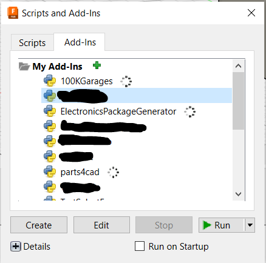

<h1>
Fusion-Exporter
</h1>

A Fusion add-in to automagically export your project into any file format.

Inspired and based on [tapnair/Project-Archiver](https://github.com/tapnair/Project-Archiver)

## Why?
Because we're lazy and don't want to manually export a file one by one.

## How?

Install the add-in by downloading the latest release from the [releases page](https://github.com/cadifyai/Fusion-Exporter/releases). Unzip the downloaded file.

Open Fusion 360, and go to the `Utilities > Add-ins` menu.

    

Click on the green `+` icon and select the extracted folder. You should see the add-in appear in the list of installed add-ins. Run the add-in by clicking on the `Run` button. You should see the `Fusion Exporter` icon show up under `Utilities`.
